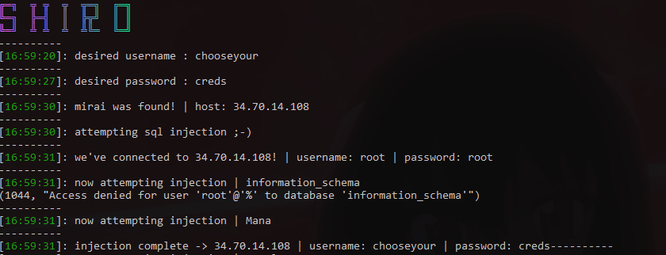

# ShiroScraper ~ By Lore<3

## A Python Mirai Botnet Scraper From Shiro (private project for now) 

Scraper Released 8/30/2021

## ❓About 

ShiroScraper Is A Mirai Scraper That Scrapes Mirai CNC IP's From URLhaus And Validates If Theres A MYSQL Server Running, Then Attempts To Brute The SQL Server, And if The Bruteforce Was Successful Then The Script Portscans The IP For The CNC Port.

##  ℹ️ Features:

• Integrated Spoofing/Proxy System

• Brutes SQL Server

• Injects A Custom Login To The CNC (IF BRUTEFORCE SUCCEEDED)

• Port scans For The CNC Port (IF BRUTEFORCE SUCCEEDED)
